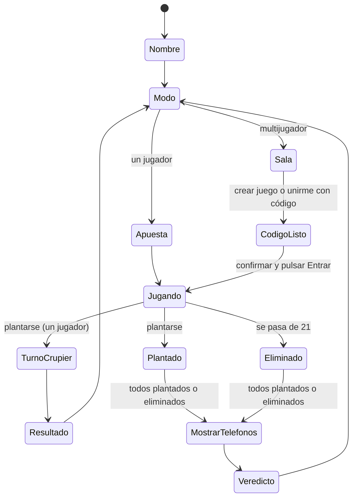

> Documento de diseño original. En el código final los nombres están en español (por ejemplo `barajaDe`, `valorMano`, `partidaMulti`) y pueden diferir de los que aparecen aquí.

# Blackjack (un jugador y multijugador local)

Aplicación web de blackjack hecha con JavaScript puro. Funciona sin servidor y sin internet: todo el estado vive en el `localStorage` del dispositivo. Este documento describe la lógica y la arquitectura antes de escribir el código. **No incluye diseño CSS**; eso viene después.

## 1. Objetivos

- Diseñada principalmente para **celular** (una mano, pantalla vertical).
- Dos modos: **Un jugador** y **Multijugador**.
- Antes de jugar se pide el **nombre** del jugador.
- En multijugador, cada teléfono lleva su propia mano y se muestra un **recuadro con la fecha y hora de creación** del juego, que a la vez es el **código de la sala**, para evitar cambios de mano.
- En multijugador **no se declara ganador automáticamente**; solo se aplica la derrota automática. El ganador se define al final, mostrando los teléfonos y pulsando un botón.

## 2. Flujo de pantallas

```
Inicio (nombre) → Menú de modo ─┬─ Un jugador → Apuesta → Partida → Resultado
                                └─ Multijugador → Sala → Partida → Todos plantados → Mostrar teléfonos → Veredicto
```

| Pantalla | Qué hace |
|---|---|
| Inicio | Pide el nombre. Se guarda y se reutiliza en las siguientes sesiones. |
| Menú de modo | Elegir un jugador o multijugador. Continuar partida guardada si existe. |
| Sala (solo multijugador) | Botones **Crear juego** y **Unirme con código**, campo para el código de la sala y botón **Entrar** (ver sección 4.4). Muestra el recuadro de fecha y hora de creación. |
| Partida | Mesa con las cartas, el total y las acciones. |
| Mostrar teléfonos | Todas las cartas visibles, para enseñar el teléfono a los demás. |
| Veredicto | Botones **Gané** y **Perdí**. |

## 3. Reglas del juego

Son comunes a ambos modos:

- Valores: 2 a 10 valen su número, J, Q y K valen 10, el As vale 11 o 1 (el mejor valor sin pasarse).
- Acciones: **Pedir carta**, **Plantarse** y **Doblar** (solo con las dos primeras cartas, en un jugador).
- Pasarse de 21 es **derrota automática**.

Diferencias por modo:

| Regla | Un jugador | Multijugador |
|---|---|---|
| Crupier | Sí, se planta en 17 | No hay crupier |
| Apuestas y fichas | Sí | No |
| Blackjack (21 con 2 cartas) | Paga 3 a 2 | Solo se muestra, no gana automáticamente |
| Quién gana | Se calcula solo | Se decide al final con el botón Gané o Perdí |
| Recuadro de fecha y hora | No | Sí, obligatorio |

> Supuesto: en multijugador no hay crupier y los jugadores se comparan entre ellos al mostrar los teléfonos. Si prefieres un crupier compartido, hay que replantear cómo se reparte.

## 4. Multijugador sin servidor

Cada jugador usa su propio teléfono y no hay comunicación entre dispositivos. Para que nadie pueda cambiar su mano, la mano se vuelve **determinista y verificable**: se calcula a partir de un código de sala (la semilla) que todos comparten en persona.

### 4.1 Carta y baraja

Una carta es un objeto `{ r: rango, p: palo }`. Hay 52 cartas por baraja, y cada jugador tiene **una sola baraja**, barajada una vez al empezar.

```js
const RANGOS = ['A','2','3','4','5','6','7','8','9','10','J','Q','K'];
const PALOS  = ['♠','♥','♦','♣'];

const crearBaraja = () =>
  Array.from({ length: 52 }, (_, i) => ({
    r: RANGOS[i % 13],
    p: PALOS[Math.floor(i / 13)],
  }));
```

Pedir carta es tomar la siguiente de esa baraja con un puntero `indiceBaraja`. La mano siempre es `baraja.slice(0, indiceBaraja)`, así que basta guardar el código, el nombre y el puntero.

### 4.2 Aleatoriedad con semilla

`Math.random()` no sirve porque no se puede repetir. Se usan tres piezas:

1. **Hash del texto** (`xmur3`): convierte el código y el nombre en un número entero.
2. **Generador pseudoaleatorio con semilla** (`mulberry32`): con el mismo número devuelve siempre la misma secuencia de valores entre 0 y 1.
3. **Barajado Fisher-Yates** que usa ese generador en lugar de `Math.random()`.

```js
function xmur3(str) {
  let h = 1779033703 ^ str.length;
  for (let i = 0; i < str.length; i++) {
    h = Math.imul(h ^ str.charCodeAt(i), 3432918353);
    h = (h << 13) | (h >>> 19);
  }
  return () => {
    h = Math.imul(h ^ (h >>> 16), 2246822507);
    h = Math.imul(h ^ (h >>> 13), 3266489909);
    return (h ^= h >>> 16) >>> 0;
  };
}

function mulberry32(a) {
  return () => {
    a |= 0; a = (a + 0x6D2B79F5) | 0;
    let t = Math.imul(a ^ (a >>> 15), 1 | a);
    t = (t + Math.imul(t ^ (t >>> 7), 61 | t)) ^ t;
    return ((t ^ (t >>> 14)) >>> 0) / 4294967296;
  };
}

function barajar(cartas, rng) {
  const a = [...cartas];
  for (let i = a.length - 1; i > 0; i--) {
    const j = Math.floor(rng() * (i + 1));
    [a[i], a[j]] = [a[j], a[i]];
  }
  return a;
}

function barajaDe(codigo, nombre) {
  const clave = codigo + '|' + nombre.trim().toLowerCase();
  const rng = mulberry32(xmur3(clave)());
  return barajar(crearBaraja(), rng);
}
```

El nombre se normaliza (minúsculas y sin espacios sobrantes) para que "Ana" y "ana " den la misma baraja.

### 4.3 La semilla es el código de la sala

La semilla es un texto con la fecha y hora de creación del juego, en formato `AAMMDD-HHMMSS`. Ese mismo texto es el **código de la sala**.

Ejemplo: un juego creado el 28 de septiembre de 2026 a las 15:42:10 tiene el código

```
260928-154210
```

```js
function crearCodigo(fecha = new Date()) {
  const d = n => String(n).padStart(2, '0');
  return d(fecha.getFullYear() % 100) + d(fecha.getMonth() + 1) + d(fecha.getDate())
    + '-' + d(fecha.getHours()) + d(fecha.getMinutes()) + d(fecha.getSeconds());
}
```

Estas son las primeras 5 cartas que salen con ese código (calculadas con el código de arriba):

| Código | Nombre | Primeras 5 cartas |
|---|---|---|
| `260928-154210` | Ana | Q♦ 8♦ 2♣ 6♣ A♥ |
| `260928-154210` | Luis | J♠ J♥ 8♦ 7♣ A♠ |
| `260928-154210` | `ana ` (minúscula y con espacio) | Q♦ 8♦ 2♣ 6♣ A♥ |
| `260928-154300` | Ana | 3♣ 6♦ A♠ Q♥ J♣ |

Qué se deduce de la tabla:

- **Mismo código y mismo nombre, mismas cartas**, en cualquier teléfono y aunque se recargue la página.
- **Mismo código y distinto nombre, distintas cartas.** No existe un "jugador 1": lo que decide las cartas es el nombre.
- **Un solo carácter distinto en el código cambia toda la baraja.** Por eso el grupo debe comparar el código exacto antes de entrar.

### 4.4 Pantalla Sala

```
┌──────────────────────────────┐
│  Sala                        │
│                              │
│  [ Crear juego ]             │
│                              │
│  Código de la sala           │
│  [ 260928-154210          ]  │
│  [ Unirme con código ]       │
│                              │
│  ┌────────────────────────┐  │
│  │ Creado: 28/09/2026     │  │
│  │ Hora:   15:42:10       │  │
│  │ Código: 260928-154210  │  │
│  └────────────────────────┘  │
│                              │
│  [x] Todos tenemos el mismo  │
│      código                  │
│  [ Entrar ]                  │
└──────────────────────────────┘
```

| Elemento | Comportamiento |
|---|---|
| **Crear juego** | Genera el código con la fecha y hora actual, lo muestra en el recuadro y lo deja listo para compartirlo. |
| **Campo de código** | Donde el jugador escribe el código de la sala que le dictó o le enseñó el anfitrión. |
| **Unirme con código** | Valida el código, lo muestra en el recuadro y traduce el código a fecha y hora legibles para que el grupo los compare. |
| **Casilla "Todos tenemos el mismo código"** | Confirmación manual del jugador después de comparar el recuadro con los demás teléfonos. |
| **Entrar** | Deshabilitado hasta que haya un código válido (creado o ingresado) y la casilla esté marcada. Al pulsarlo se genera la baraja, se reparte y se pasa a la partida. |

Reglas importantes:

- **"Cuando todos puedan ingresar"** es una confirmación humana. Como los teléfonos no se comunican, la app no puede saber si los demás ya escribieron el código; por eso cada jugador espera a que el grupo lo confirme en voz alta y entonces marca la casilla y pulsa **Entrar**.
- **Al pulsar Entrar, el código se bloquea.** No se puede cambiar mientras la partida esté en curso. Salir de la partida exige confirmar y deja la partida marcada como abandonada, para que no sirva para "repetir" una mano con otro código.
- **Validación del código:** debe cumplir el formato `AAMMDD-HHMMSS` (dos dígitos por cada parte) y representar una fecha y hora reales. Un código como `261399-256199` se rechaza con un mensaje que explique el formato esperado.
- Todos los jugadores deben escribir un **nombre distinto**. Si el nombre coincide con otro, la baraja sería idéntica; la app avisa, pero no puede comprobarlo entre dispositivos.

### 4.5 Límites y decisiones abiertas

- **Baraja propia por jugador.** Dos jugadores pueden recibir la misma carta. Una alternativa es una baraja compartida y repartida por posición (con N jugadores, el jugador número `i` toma las cartas `i, i+N, i+2N...`), pero exige que todos se pongan de acuerdo en N y en su número. Por ahora se mantiene la baraja individual por nombre.
- **Confianza entre jugadores.** El código y el algoritmo no son secretos: alguien con conocimientos técnicos podría calcular su baraja de antemano o editar su `localStorage`. La verificación real ocurre al enseñar los teléfonos con las cartas abiertas.
- **Mejora opcional: secreto por jugador.** Añadir un número aleatorio que se guarda en el teléfono (`codigo + nombre + secreto`), mostrar al empezar su huella (hash) y revelar el secreto al enseñar el teléfono. Así nadie puede predecir ni cambiar sus cartas. Queda pendiente de decidir.
- **Código completo o corto.** El código con la fecha completa es largo de dictar. Uno más corto (por ejemplo `K7Q2` derivado de la fecha) es más cómodo, pero es más fácil que dos juegos distintos coincidan.

## 5. Máquina de estados



En multijugador el paso a **MostrarTelefonos** no es automático entre dispositivos. Como cada teléfono es independiente, cada jugador pulsa **Ya estamos todos plantados** cuando el grupo lo confirma en voz alta, y solo entonces se destapan sus cartas.

## 6. Modelo de datos

Todo se guarda en `localStorage` como JSON, con claves versionadas.

```json
// bj:perfil
{ "nombre": "Ana" }

// bj:solo  (modo un jugador)
{ "fichas": 1000, "ganadas": 0, "perdidas": 0, "empates": 0 }

// bj:multi  (partida multijugador en curso)
{
  "codigo": "260928-154210",
  "creadoEn": "2026-09-28T15:42:10",
  "codigoBloqueado": true,
  "jugador": "Ana",
  "indiceBaraja": 5,
  "mano": ["A♠", "7♦", "9♣"],
  "estado": "plantado",
  "veredicto": null
}
```

Reglas de guardado:

- Guardar **después de cada acción** (pedir, plantarse, veredicto), no solo al final.
- Al abrir la app, si existe `bj:multi` sin terminar, se ofrece **continuar** y no se reparte de nuevo.
- Envolver siempre lecturas y escrituras en `try/catch`, y tener un valor por defecto si el almacenamiento falla.

## 7. Arquitectura de código

Un solo proyecto estático, sin dependencias, que se abre desde cualquier dispositivo.

```
blackjack/
├── index.html
├── README.md
└── js/
    ├── storage.js   # leer y guardar en localStorage (con try/catch)
    ├── rng.js       # generador con semilla y barajado
    ├── engine.js    # baraja, valor de la mano, reglas (sin tocar el DOM)
    ├── solo.js      # flujo del modo un jugador
    ├── multi.js     # flujo del modo multijugador
    ├── ui.js        # dibuja pantallas y lee los botones
    └── main.js      # arranque y navegación entre pantallas
```

Principios:

- **`engine.js` no conoce el DOM.** Solo recibe datos y devuelve datos, así se puede probar con facilidad.
- **Un único objeto de estado** que `ui.js` dibuja. Cada acción cambia el estado, lo guarda y vuelve a dibujar.
- Navegación con una variable `pantalla` y una función `mostrar(pantalla)`, sin librerías.
- Cargar los archivos con `<script>` normales. Los módulos ES (`import`) no funcionan si se abre `index.html` directamente desde el archivo (`file://`) en algunos navegadores.

### Funciones principales

| Módulo | Funciones |
|---|---|
| `rng.js` | `xmur3(texto)`, `mulberry32(numero)`, `barajar(cartas, rng)` |
| `engine.js` | `crearBaraja()`, `barajaDe(codigo, nombre)`, `valorMano(mano)`, `seHaPasado(mano)`, `esBlackjack(mano)` |
| `solo.js` | `repartir()`, `pedir()`, `plantarse()`, `doblar()`, `turnoCrupier()`, `resolver()` |
| `multi.js` | `crearCodigo()`, `validarCodigo(texto)`, `crearJuego(nombre)`, `unirse(nombre, codigo)`, `entrar()`, `pedir()`, `plantarse()`, `mostrarTelefonos()`, `darVeredicto(gano)` |
| `storage.js` | `leer(clave, porDefecto)`, `guardar(clave, valor)`, `borrar(clave)` |

## 8. Casos límite

- **Nombre vacío o repetido:** exigir al menos un carácter. En multijugador, dos jugadores con el mismo nombre tendrían la misma baraja, así que se recomienda avisar.
- **Código mal escrito al unirse:** rechazar los códigos con formato inválido o fecha imposible y, si es válido, mostrar la fecha y hora resultantes para que el grupo las compare de inmediato.
- **Entrar sin código o sin confirmar:** el botón Entrar permanece deshabilitado.
- **Recarga a mitad de partida:** se restaura el estado guardado, sin repartir de nuevo.
- **Sin fichas (un jugador):** ofrecer reiniciar la partida.
- **Pasarse de 21 en multijugador:** el jugador queda eliminado, sigue mostrando su mano y el veredicto queda como Perdí.
- **Acabarse la baraja (un jugador):** volver a barajar cuando queden menos de 20 cartas.

## 9. Diseño (pendiente)

Lo que ya está decidido, sin CSS todavía:

- **Prioridad al celular:** pantalla vertical, botones grandes y fáciles de tocar con el pulgar, acciones en la parte inferior.
- El recuadro de fecha y hora y la pantalla de mostrar teléfonos deben verse claros a distancia.
- Etiqueta `viewport` correcta y uso de áreas seguras del teléfono.

## 10. Plan de trabajo

1. `engine.js` y `rng.js` (lógica pura).
2. `storage.js` y el flujo de nombre.
3. Modo un jugador completo.
4. Modo multijugador: sala, partida, mostrar teléfonos y veredicto.
5. Diseño CSS pensado para celular.
6. Extras opcionales: dividir pares, seguro y rendirse.
